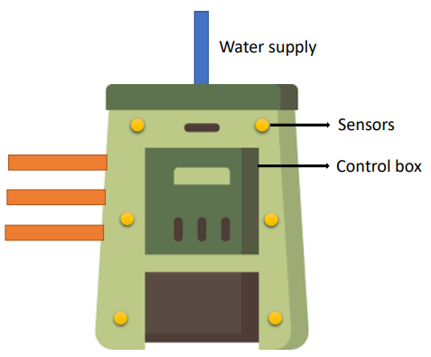
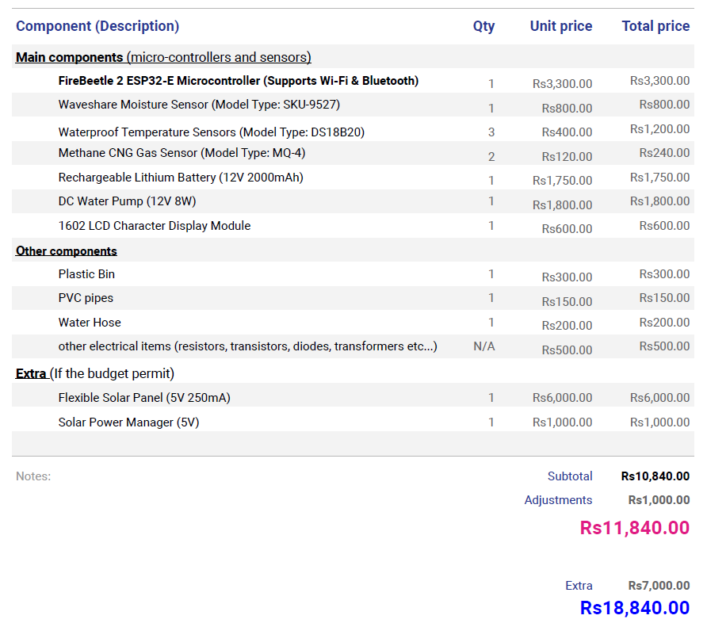

[comment]: # "This is the standard layout for the project, but you can clean this and use your own template"

# Smart Compost Management System

---

## Team
-  E/18/077, Dharmarathna N.S., [email](mailto:e18077@eng.pdn.ac.lk)
-  E/18/224, Mihiranga G.D.R., [email](mailto:e18224@eng.pdn.ac.lk)
-  E/18/227, Mudalige D.H., [email](mailto:e18227@eng.pdn.ac.lk)

<!-- Image (photo/drawing of the final hardware) should be here -->

<!-- This is a sample image, to show how to add images to your page. To learn more options, please refer [this](https://projects.ce.pdn.ac.lk/docs/faq/how-to-add-an-image/) -->

<!--  -->

#### Table of Contents
1. [Introduction](#introduction)
2. [Problem Definition](#problem-definition)
3. [Solution Architecture](#solution-architecture )
4. [Hardware & Software Designs](#hardware-and-software-designs)
5. [Testing](#testing)
6. [Estimated budget](#estimated-budget)
7. [Conclusion](#conclusion)
8. [Links](#links)

---
## Introduction

The smart compost management system is capable of monitoring and managing compost mixtures by adding air and water and other essentials when needed. 

Usually when making compost in household we dump kitchen scraps & leaves into a bin & we let it be converted to compost by keeping it for a long time. This process is called anaerobic composting. And there are few problems in this method. They are, it will take years to happen, anaerobic composting causes a higher output of methane gas, attracts rodents, and emits hydrogen sulfide and cadaverine. 

Currently it’s hard to find a proper solution for this problem in the local market. Our solution for this matter is aerobic composting. This method uses oxygen to feed the microorganisms that break down the compost. From this method usable compost can be created within a month if the essential requirements were given. And this method won’t create methane. We can measure the temperature, moisture, methane gas output of the compost mixture and these readings can be displayed through a web and mobile interface. Our system will recognize whether the compost mixture has been made or not by using the sensors and it will let us know when the compost is ready. According to the measured readings we can add water and control the air vents of our compost bin automatically.

---
## Problem Definition
Landfills are a huge problem in the modern world 
Release of methane gas which cause for global warming and spread of diseases are few main problems of landfills 
There is a huge percentage of food scraps and yard waste in landfills 
What if we make compost out of these materials? 
Unfortunately, most do not compost in the household. Why? 
General process, which is called anaerobic composting, can take years 
Anaerobic composting causes a higher output of methane gas, attracts rodents, and emits hydrogen sulfide and cadaverine 

---
## Introduction to Solution
Aerobic composting: A Better Way to Compost(Involves aerating the compost, Adding materials to maintain heat/pH, Watering the compost as needed) 
Methane gas is not created 
Usable compost can be created in as little as four weeks 
Can be implemented in small space(Household level solution) 

---
## Our Product
---

---
## Solution Architecture
---

### Technology Stack
- Web application: Jekyll (HTML, CSS, JavaScript and Bootstrap)
- Data structure: JSON
- Data processing: Python Scripts
- Databases: Firebase, SQLite
- Web and Mobile interface designing: Figma
- Version control and documentation: GitHub

---
### Generation of Data
Compost temperature --> Methane gas output 
Temperature sensor  --> Methane gas sensor 
Compost moisture    --> Water level 
Moisture sensor     --> Water level float sensor 

---
## Hardware and Software Designs

---
## Demonstration Plan

---
## Estimated budget

<!-- All items and costs

| Item          | Quantity  | Unit Cost  | Total  |
| ------------- |:---------:|:----------:|-------:|
| Sample item   | 5         | 10 LKR     | 50 LKR | -->

---

## Project Timeline

---
## Links

- [Project Repository](https://github.com/cepdnaclk/e18-3yp-Smart-Compost-Management-System)
- [Project Page](https://cepdnaclk.github.io/e18-3yp-Smart-Compost-Management-System/)
- [Department of Computer Engineering](http://www.ce.pdn.ac.lk/)
- [University of Peradeniya](https://eng.pdn.ac.lk/)

[//]: # (Please refer this to learn more about Markdown syntax)
[//]: # (https://github.com/adam-p/markdown-here/wiki/Markdown-Cheatsheet)
